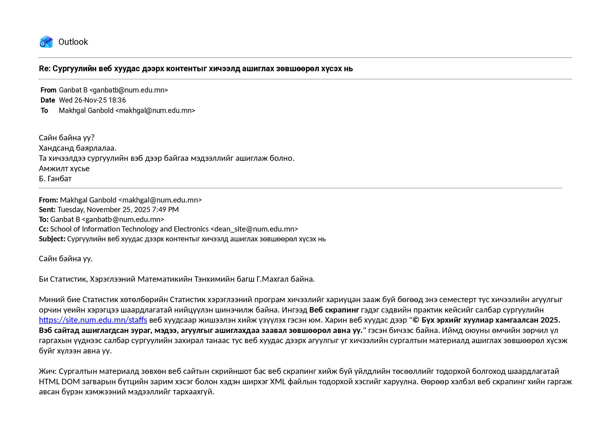
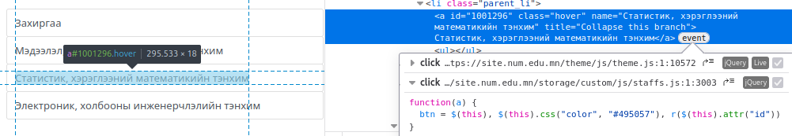

# Бодит кейс буюу вебээс ялгаж авах өгөгдөл

Удиртгалд дурдсанчлан тодорхой жишээ буюу бодит веб сайтаас скапинг хийнэ. Ингээд МУИС-ийн Мэдээллийн технологи, электроникийн сургуулийн багш нар болон ажилчдын мэдээллийг @NUM_staffs_2025 авч үзье. Тус веб хуудас [https://site.num.edu.mn/staffs](https://site.num.edu.mn/staffs) хаягтай. Веб хуудасны харагдацыг @fig-site-staff дээрээс харж болно.

::: {#fig-site-staff fig-cap="Скрапинг хийх веб хуудасны харагдац"}
{width=70%}
:::

Тус веб хуудаснаас багш, ажилчдын нэр, албан тушаал, имэйл, утас, ажлын өрөө зэрэг мэдээллийг "хайчлан" авч болох нь харагдана.

# Веб хуудасны DOM загвар

Веб хуудсыг HTML @w3schools_html_reference хэлээр бичдэг. Энэ нь `<html>` гэж эхлээд `</html>` гэж дуусна. Үүн шиг элементийг тиг гэнэ. Хуудасны гол агуулга `<body></body>` тиг дотор байрлана. Мэдээж веб хуудас дотор ямар мэдээлэл орох бас мэдээллийг хэрхэн зохион байгуулахаас шалтгаалж үндсэн `<body></body>` тиг дотор `<div></div>`, `<p></p>`, `` гэх мэтчилэн тигүүдийг тухайн зохион байгуулалтын дагуу ашиглана. Энд `<p></p>` параграф, `` зураг оруулах зориулалттай.

Эдгээр элементүүд нь хоорондоо багталцсан буюу салбарласан мод мэт бүтэц үүсгэнэ. Энэ бүтэц нь веб хөтчөөр уншигдах үед Document Object Model (DOM) @enwiki:1316812336 гэдэг загвар болж хувирдаг. DOM нь HTML документыг мод хэлбэрээр төлөөлж, програмчлалын аргаар (жишээлбэл веб хөтөч дээр JavaScript хэл эсвэл веб скрапингийн үед R хэлний rvest гэх мэт багц ашиглаж) документын агуулга болон бүтэцтэй нь харьцах боломж олгодог.

Ийм DOM бүтэцтэй байдал нь веб хуудасны элементүүд рүү (selector ашиглан) хандаж улмаар мэдээллийг нь ялган авах буюу веб скрапинг хийх боломжийг бүрдүүлдэг.

Түүнчлэн HTML элемент буюу тиг нь `id`, `class` зэрэг аттрибуттай байж болдог. Тиг тодорхой аттрибуттай бол скрапинг хялбарчлагддаг. Тухайлбал `id` таг HTML хэлний дүрмээр цор ганц байх тул веб хуудасны тодорхой хэсгийг барьж авах найдвартай барьц болдог. Жишээлбэл @fig-site-staff дээр харагдаж буй ажилчдын нэрс бүхий багана орчмын DOM загварын бүтцийг ажиглавал `<div class="col-md-12" id="emps">` буюу `emps` гэсэн `id` аттрибуттай тиг олдоно. Тэгэхээр ажилчдын мэдээллийг тус тигээс цааш салбарласан элементүүдээс хайж олно. Веб хуудас дээрх тодорхой хэсгийн элементүүдийн аттрибут болон DOM бүтцийг харахдаа компьютер дээр ажиллах веб хөтөч ашиглана. Веб хөтчид тухайн веб хуудсыг ачаалж байгаад хүссэн хэсэгтээ хулганын курсорыг аваачиж байгаад хулганын баруун товчлуур дээр товшино. Товчлуур дарахад нээгдэх цэсээс "Inspect" гэснийг сонгож товшино. Нээгдэх цонхоос HTML документын аль элемент хаана, ямар харагдацтай байгааг харж нэгжсээр хүссэн элемент дээрээ очно. Хэрэв тус элемент `id` зэрэг аттрибуттай бол тэр нь харагдаж байх болно.

# Веб скрапинг хийхэд баримтлах зарчим

Веб скрапинг хийхдээ хууль, ёс зүйн болон техникийн тодорхой хэм хэмжээнд ажиллавал зүйтэй @datacamp2025_ethical_web_scraping.

* Мэдээлэл тархаах зориулалттай API байвал түүнийг нь ашиглах
* Сайтын robots.txt файлыг шалгаж, заасан хоригийг үл зөрчих
* Хувийн мэдээлэл, хамгаалагдсан хэсэг рүү хандахгүй байх
* Нэг дор хэт олон хүсэлт илгээхгүй байх

## API

Манай кейсийн хувьд API алга байна.

## robots.txt

Веб сайтын robots.txt файлыг [https://site.num.edu.mn/robots.txt](https://site.num.edu.mn/robots.txt) гэж нээн үзвэл дараах агуулга гарч ирэв.

```
User-agent: *
Disallow:
```

Энэ нь robots.txt @wix_robots_txt_guide дэх дүрэм `User-agent: *` буюу бүх роботуудад хамаатай бөгөөд `Disallow:` буюу тус талбар хоосон байгаа нь ямар ч зам руу хандан орж болохыг зөвшөөрсөнийг илтгэнэ. Өөрөөр хэлбэл скрапинг хийхэд хязгаарлалт байхгүй гэжээ.

## Хувийн мэдээлэл, хамгаалагдсан хэсэг

Веб скрапингийг хийхдээ admin зэрэг хаалттай, хувийн мэдээллийн хэсэг рүү нэвтрэхгүй.

Түүнчлэн энэ веб скрапингийн тайлан болон үүсэх файлуудад зөвхөн веб сайтын скрийншот бас веб скрапинг хийж буй үйлдлийн төсөөллийг тодорхой болгоход шаардлагатай HTML/XML DOM загварын бүтцийн зарим хэсгийг л харуулна. Өөрөөр хэлбэл веб скрапинг хийн гаргаж авсан бүрэн хэмжээний өгөгдлийг файлд хадгалан, ашиглахад шууд бэлэн болгож тархаахгүй.

## Нэг дор илгээх хүсэлтийн тоо

DoS халдлага @cloudflare_dos_attack мэт веб серверийг ачаалахгүйн нэг дор илгээх хүсэлтийн тоог анхаарна. Иймээс кэш хувьсагч ашиглах зэргээр өмнө дуудаж авсан мэдээллийг ахин дуудахаас зайлсхийнэ. Мөн шаардлагагүй хүсэлт илгээхгүй. Веб скрапинг ажлын програмын кодын гол хэсгийг бичсэний дараа серверт илгээх хүсэлтүүдийг бүртгэхэд 5 удаагийн дэс дараалсан хүсэлт гарсан. Харин төслийн ажлын бүх кодыг бүрэн ажиллуулбал 7 хүсэлт илгээж байна.

## Оюуны өмчийн зөрчлөөс зайлсхийх

Веб скрапинг хийхээр сонгосон веб хуудас дээр оюуны өмчийн "© Бүх эрхийг хуулиар хамгаалсан 2025. Вэб сайтад ашиглагдсан зураг, мэдээ, агуулгыг ашиглахдаа заавал зөвшөөрөл авна уу" гэсэн бичээс байсан тул веб скрапинг хийхээс өмнө зохих албан тушаалтнаас зөвшөөрөл авсан. Зөвшөөрсөн хариу бүхий имэйлийг @fig-permission дээрээс харж болно.

::: {#fig-permission fig-cap="Веб скрапинг хийх зөвшөөрөл"}
{width=70%}
:::

# Веб скрапинг хэрэгжүүлэлт

Веб скрапинг ажлын эхэнд зайлшгүй хийх үйлдэл бол HTML документыг татаж авах явдал юм. Үүнд *requests* модул ашиглана.

```{r}
#| eval: false

url <- "https://site.num.edu.mn/staffs"

response <- httr::GET(url)
html <- httr::content(response, "text", encoding = "UTF-8")
```

## JavaScript үл шаардах веб скрапинг

*httr* багц ашиглан HTML хуудас татаж авна. Харин HTML документыг DOM загвараар хөрвүүлэхэд *rvest* багц ашиглана.

```{r}
#| eval: false

html_dom <- rvest::read_html(html)
```

Ийнхүү HTML документыг DOM загвараар хөрвүүлэн боловсруулсаны дараа веб скрапингийн гол цөм болох өгөгдөл "хайчилж" авах ажил эхэлнэ. Жишээлэн элементийг `id` аттрибутаар нь хайн олох кодыг дор бичив.

```{r}
#| eval: false

# units гэсэн id аттрибуттай элементийг хайж олох
html_dom |>
	rvest::html_element("#units") ->
	units
units |> as.character() |> cat()
```

Үүнээс гадна элементийн нэр, классын нэр зэргээр хайж олох арга бий. Эдгээр үйлдлийг `page |> rvest::html_elements("p")`, `page |> rvest::html_elements(".members")` гэх мэтчилэн гүйцэтгэнэ. Цаашилбал сонгосон элементийн тесктийг `units |> rvest::html_text2()`, аттрибутыг `units |> rvest::html_attr("id")` байдлаар олно.

Дээрх кодыг ажиллуулбал дараах үр дүн гарна.

    <div class="col-md-3" id="units">
    </div>

Өөрөөр хэлбэл элемент хоосон байна. Гэвч инспект хийхэд тус `<div></div>` элемент хоосон байгаагүй. Энэ нь HTML документын агуулгын зарим хэсгийг DOM хөрвүүлж дууссаны дараа JavaScript ажиллуулан ачаалсаны шинж байж болно. Ингээд илүү няхуур инспект хийтэл ажилчдын нэрс ч JavaScript код ажилласнаар ачаалагдаж байгаа нь мэдэгдлээ. Тэгэхээр JavaScript дэмждэг веб скрапинг хэрэглүүр ашиглах хэрэгтэй.

## JavaScript шаардлагатай веб скрапинг

Веб скрапингаар авах мэдээлэл нь HTML документыг DOM загварт хөрвүүлсэний дараа JavaScript код ажиллахад веб серверээс дуудагдан ачаалагддаг бол JavaScript дэмждэг веб скрапинг хийнэ.

JavaScript ажиллуулан веб скрапинг хийхэд ашиглаж болох багц гэвэл *chromote* болон *RSelenium* зэргийн нэрийг дурдаж болно. Эдгээрээс *chromote* багцыг ашиглана.

```{r}
#| eval: false

load_html <- function(url, wait = 5) {

	# 1. Chrome session үүсгэх (Headless горимоор)
	b <- chromote::ChromoteSession$new()

	# 2. Тухайн веб сайт руу хандах
	# Page.navigate функц нь хуудсыг дуудна
	b$Page$navigate(url)

	# 3. Хуудас бүрэн ачаалж, AJAX хүсэлтүүд дуусахыг хүлээх
	# Хялбар шийдэл: Тодорхой хугацаанд хүлээх (Жишээ нь 5 секунд)
	# Энэ нь JavaScript ажиллаж, мэдээллээ татаж авах боломж олгоно.
	Sys.sleep(5)

	# 4. Бүрэн рендер хийгдсэн HTML бүтцийг (DOM) JavaScript ашиглан татаж авах
	# document.documentElement.outerHTML гэдэг нь тухайн үеийн бүх HTML кодыг авна
	html_string <- b$Runtime$evaluate("document.documentElement.outerHTML")$result$value

	# 5. Chrome session-ийг хаах
	b$close()

	# 6. Гарсан үр дүнг функцийн утга болгон буцаах
	html_string

}

html <- load_html("https://site.num.edu.mn/staffs")
```

## HTML документыг үзэмжтэй болгох

HTML документын бичиглэл хүн уншихад төвөгтэй байлаа. Өөрөөр хэлбэл `<div>` гэж эхэлсэн элемент чухам хаана `</div>` гэж хаагдаж буйг харахад бэрхшээлтэй байна. Хэрэв элементийн эхлэл төгсгөл бүрийг нэг мөрд бичиж бас эдгээр нь цогц нэг элемент тул мөрийн эхнээс ижил зай бүхий догол мөрд жигдлэн бичвэл HTML документыг уншихад хялбар болдог. Ийнхүү үзэмжтэй болгон хадгалахад *xml2* багцын `write_html()` функц ашиглана. HTML документыг "htmls/staffs.html" файлд хадгалав.

```{r}
#| eval: false

html |>
	xml2::read_html() ->
	html_dom
html_dom |>
	xml2::write_html(file = "htmls/staffs.html", options = "format")
```

```{r}
#| echo: false

html_dom <- xml2::read_html("htmls/staffs.html")
```

## Өгөгдөл ялгаж авах

Одоо HTML документын DOM загварын дагуух бүтцэд тулгуурлан хэрэгтэй өгөгдлөө ялгаж авна. Чухамдаа энэ нь л веб скрапингийн гол ажил болох "хайчилбар" авах үйлдэл юм.

```{r}
#| eval: false

emps <- html_dom |> rvest::html_node("#emps")

members <- emps |> rvest::html_nodes("div.members")

results <- list()

for (m in members) {
	# (1) Ажилчдын нэр (<h1> -> <a> -> text)
	h1 <- m |> rvest::html_node("h1")
	name <- h1 |> rvest::html_text(trim = TRUE)

	# (2) Албан тушаал (<h1> элементийн яг дараагийн <p>)
  # <h1> -> parent element -> first <p> element
	position <- h1 |>
		xml2::xml_parent() |>
		rvest::html_node("p") |>
		rvest::html_text(trim = TRUE)
	
	# Албан тушаалын өмнөх чагтыг зайлуулах
	position <- if (!is.na(position) && nchar(position) > 0) {
		substring(position, 2) 
	} else {
		NA_character_
	}

	# (3) имэйл, утас, ажлын өрөө агуулсан <p> элементүүд
	right_col <- m |> rvest::html_nodes("div.col-md-4")
	details <- character(0)
	if (length(right_col) > 1) {
		details_col <- right_col[[2]]
		details <- details_col |>
			rvest::html_nodes("p") |>
			rvest::html_text(trim = TRUE)
	}

  # (4) Үр дүнг хадгалах
	results[[""]] <- c(
		name, position, details
	)

}

print(results)
```

Одоо нэг асуудал гарсан нь тэнхимүүдийн багш, ажилчдын мэдээллийг авах явдал юм. Асуудал гэсний шалтгаан уг мэдээлэл веб хуудсын зүүн гар талын баганад буй цэс дэх линк дээр товшиход бас л JavaScript кодын тусламжтай ачаалагдаж байгаад оршино. Линк дээр товшиход ямар JavaScript ажиллахыг @fig-link-inspection зураг дээр үзүүлсэн шиг инспект хийн харж болно.

::: {#fig-link-inspection fig-cap="Линк дээр товшиход ажиллах JavaScript код"}
{width=70%}
:::

Улмаар чухам ямар код ажиллан юу болж буйг мэдэхийн тулд "staff.js" файлыг нээгээд `r($(this).attr("id"))` кодоос эхлэн уншина. Ийнхүү нээтэл minify хийсэн файл байв. Кодыг beautify хийн уншихад хялбар болгов.

```javascript
var array_unit = [],
	array_emp = [],
	array_all = [],
	array_emp_filtered = [],
	k = 0,
	un = "",
	btn = "",
	lng = 1;
$(function() {
	function r(a) {
		array_emp.length = 0, array_all.length = 0, $.ajax({
			type: "GET",
			url: "https://portal.num.edu.mn/handler/myhandler.ashx?nr=9&lng=1&par1=" + a,
			dataType: "xml",
			cache: !1,
			async: !1,
			success: function(a) {
				$(a).find("row").each(function(a) {
					var r = {
						id: $(this).attr("id"),
						nm: $(this).attr("nm"),
						mail: $(this).attr("mail"),
						workmail: $(this).attr("workmail"),
						bu: $(this).attr("bu"),
						po: $(this).attr("po"),
						pos: $(this).attr("pos"),
						un: $(this).attr("un"),
						uh: $(this).attr("uh"),
						uid: $(this).attr("uid"),
						pt: $(this).attr("PosType")
					};
					array_emp.push(r)
				}), 0 < array_emp.length && function() {
					var a = "";
					a += '<div class="row">';
					for (var r = 0; r < array_emp.length; r++) {
						var t = "",
							i = "";
						if ("" != array_emp[r].mail)
							for (var s = array_emp[r].mail.split("#"), n = 0; n < s.length; n++) t += '<p><i class="fas fa-envelope"></i>' + s[n] + "</p>";
						if ("" != array_emp[r].workmail)
							for (var e = array_emp[r].workmail.split("#"), n = 0; n < e.length; n++) i += '<p><i class="fas fa-building"></i>' + e[n] + "</p>";
						var l = "";
						"" != array_emp[r].po && (l = '<p><i class="fas fa-phone"></i>' + array_emp[r].po + "</p>");
						var p = "";
						"" != array_emp[r].bu && (p = '<p><i class="fas fa-map-pin"></i>' + array_emp[r].bu + "</p>"), a += '<div class="col-md-12"><div class="members"><div class="row">', a += '<div class="col-md-3"></div>', a += '<div class="col-md-4"><h1 class="font-weight-normal line-height-1"><a href="/staffs/details?id=' + array_emp[r].id + "&uid=" + array_emp[r].uid + '">' + array_emp[r].nm + "</a></h1><p>" + array_emp[r].pos + '</p></div><div class="col-md-4">' + t + i + l + p + "<a href='/staffs/details?id=" + array_emp[r].id + "&uid=" + array_emp[r].uid + "' class='button btn btn-xs btn-light text-1 text-uppercase staff-more'>Дэлгэрэнгүй</a></div></div></div><br>"
					}
					$("#emps").html(a)
				}()
			},
			error: function(a, r, t) {
				$("#emps").html("")
			}
		})
	}
	$.ajax({
		type: "GET",
		url: "https://portal.num.edu.mn/handler/myhandler.ashx?nr=14&lng=1&par1=1002076",
		dataType: "xml",
		cache: !1,
		async: !1,
		success: function(a) {
			$(a).find("row").each(function() {
				var a = {
					id: $(this).attr("ID"),
					un: $(this).attr("Un"),
					pu: $(this).attr("Pu"),
					ot: $(this).attr("Ot")
				};
				array_unit.push(a)
			}), a = "", a += '<div class="tree">', a += function a(r) {
				var t = "<ul>";
				for (var i = 0; i < array_unit.length; i++) array_unit[i].pu == r && (0 == k && (un = array_unit[i].id), 1002076 == r || array_unit[i].pu == un ? t += "<li>" : t += '<li class="">', k++, t += '<a id="' + array_unit[i].id + '" name="' + array_unit[i].un + '" class="hover">' + array_unit[i].un + "</a>", t += a(array_unit[i].id), t += "</li>");
				t += "</ul>";
				return t
			}(1002076), a += "</div>", $("#units").html(a)
		},
		error: function(a, r, t) {
			$("#myaccordion").html("")
		}
	}), $(".tree li:has(ul)").addClass("parent_li").find(" > a").attr("title", "Collapse this branch"), $(".all_units").hide("fast"), $("#uname").text($("#1001028").attr("name")), r(1002081), btn = $("#1002081"), $(".tree li.parent_li > a").on("click", function(a) {
		btn = $(this), $(this).css("color", "#495057"), r($(this).attr("id"))
	})
});
```

`r($(this).attr("id"))` код файлын төгсгөлд байна. Энд дуудан ажиллуулах `r()` функцийг файлын бараг эхэнд зарлажээ. Функцийг бие дэх кодыг уншвал тус функц `"https://portal.num.edu.mn/handler/myhandler.ashx?nr=9&lng=1&par1="+a` линк рүү GET аргаар AJAX хүсэлт илгээгээд XML @w3schools_xml_reference форматтай хариу хүлээн авах нь мэдэгдэнэ. Түүнчлэн линк нь `r(a)` функцийн `a` аргументаар ямар утга дамжуулсанаас хамаарч эцэслэн тодорхой болно.

`r(a)` функцийг "staff.js" файл дотор `$(function() {` гэж эхэлсэн, DOM бэлэн болмогц ажиллах функц дотор зарлажээ. Кодыг цааш уншвал `r(a)` функцийг файлын төгсгөл хавьд `r(1002081)` гэж дуудсан ба энэ нь DOM бэлэн болмогц ажиллахаар бичигджээ. Ингээд `"https://portal.num.edu.mn/handler/myhandler.ashx?nr=9&lng=1&par1=1002081"` линкээр GET @w3schools_http_methods хүсэлт илгээв. GET аргаар хүсэлт илгээхийн тулд ердөө веб хөтчийн хаягийн мөрд тус линкийг оруулаад Enter товчлуур дарахад хангалттай. Серверээс ирсэн хариуг дор хуулж орууллаа.

```xml
<ROOT>
<row id="86B5490F-7E03-41A9-A52B-D9398B7B7399" nm="Б.Ганбат" bu="" po="75754400, 77307730 - 3100" pos="#Захирал" PosOrder="120" PosType="1" uid="1002081" un="Захиргаа" uh="МУИС, МТЭС, З" mail="ganbatb@num.edu.mn" workmail="dean_site@num.edu.mn" saunit="0"/>
<row id="E12165F7-39AB-4028-9568-CB9194ADD1FF" nm="Т.Мөнхгэрэл" bu=" Хичээлийн байр 7-203" po="75754400, 77307730 - 3101" pos="#Захирлын туслах" PosOrder="228" PosType="2" uid="1002081" un="Захиргаа" uh="МУИС, МТЭС, З" mail="munkhgerel@num.edu.mn" workmail="assistant_site@num.edu.mn" saunit="0"/>
<row id="31BA5606-8B18-4CB4-A943-930A49937B8A" nm="Г.Энхжаргал" bu=" Хичээлийн байр 7-212" po="75754400, 77307730 - 3114" pos="#Ахлах нягтлан бодогч" PosOrder="312" PosType="2" uid="1002081" un="Захиргаа" uh="МУИС, МТЭС, З" mail="enkhjargal.g@num.edu.mn" workmail="" saunit="0"/>
<row id="AE54C397-B996-4062-AB74-EF21CC83A3F5" nm="Ж.Батхүү" bu=" Хичээлийн байр 7-212" po="" pos="#Нягтлан бодогч /Үндсэн хөрөнгө, бараа материал/" PosOrder="313" PosType="2" uid="1002081" un="Захиргаа" uh="МУИС, МТЭС, З" mail="batkhuu.j@num.edu.mn" workmail="" saunit="0"/>
<row id="5FA26970-43FF-4340-99A2-EDF01B6D8398" nm="Г.Буянхишиг" bu="" po="" pos="#Талбайн үйлчлэгч" PosOrder="443" PosType="3" uid="1002081" un="Захиргаа" uh="МУИС, МТЭС, З" mail="" workmail="" saunit="0"/>
<row id="8D5352EB-AF3A-414D-9EB1-1B8BB3B172E8" nm="Г.Уранцэцэг" bu="" po="" pos="#Талбайн үйлчлэгч" PosOrder="443" PosType="3" uid="1002081" un="Захиргаа" uh="МУИС, МТЭС, З" mail="" workmail="" saunit="0"/>
<row id="4FD62D80-FC43-4CE1-858D-45601E0CC358" nm="Д.Золжаргал " bu="" po="" pos="#Талбайн үйлчлэгч" PosOrder="443" PosType="3" uid="1002081" un="Захиргаа" uh="МУИС, МТЭС, З" mail="" workmail="" saunit="0"/>
<row id="FE815EFF-8B27-4621-90F9-D3AB47277BF3" nm="Н.Батнасан" bu="" po="" pos="#Талбайн үйлчлэгч" PosOrder="443" PosType="3" uid="1002081" un="Захиргаа" uh="МУИС, МТЭС, З" mail="" workmail="" saunit="0"/>
<row id="82B4534C-5012-4F23-BA51-AFA89FDE8CD3" nm="Н.Дагиймаа" bu="" po="" pos="#Талбайн үйлчлэгч" PosOrder="443" PosType="3" uid="1002081" un="Захиргаа" uh="МУИС, МТЭС, З" mail="" workmail="" saunit="0"/>
</ROOT>
```

Ийнхүү веб хуудсыг дуудаж ачаалахад захиргааны харьяа ажилчдын мэдээлэл гарч ирсэний учир тодорхой болов. Нөгөө талаас энэ мэдээллийг аль хэдийн "хайчлаад" авчихсан тул ингэсхийн орхиж харин бусад линк дээр товшиход гарч ирэх тэнхимүүдийн багш, ажилчдын мэдээллийг гаргаж авахад л анхаарлаа хандуулна.

Салбар сургуулийн захиргаа болон тэнхимүүдийн мэдээлэл "staff.js" файлд буй хоёр дахь AJAX хүсэлтийн хариуд ирэх ажээ. Эхний AJAX үйлдэл шиг GET аргаар `"https://portal.num.edu.mn/handler/myhandler.ashx?nr=14&lng=1&par1=1002076"` линкээр хүсэлт илгээн XML хариу хүлээн авч байна. XML документаас зөвхөн салбар сургуультай хамаатай хэсгийг дор хуулж оруулав.

```xml
<root>
<row ID="1002081" Un="Захиргаа" Ab="МУИС, МТЭС, З" Hp="https://site.num.edu.mn" Pu="1002076" Ot="10"/>
<row ID="1001298" Un="Мэдээлэл, компьютерийн ухааны тэнхим" Ab="МУИС, Мтэс, Мкут" Hp="http://seas.num.edu.mn/dep/ics" Pu="1002076" Ot="9"/>
<row ID="1001296" Un="Статистик, хэрэглээний математикийн тэнхим" Ab="МУИС, Мтэс, Схмт" Hp="http://seas.num.edu.mn/dep/am" Pu="1002076" Ot="9"/>
<row ID="1001297" Un="Электроник, холбооны инженерчлэлийн тэнхим" Ab="МУИС, Мтэс, Эхит" Hp="http://seas.num.edu.mn/dep/ece" Pu="1002076" Ot="9"/>
</root>
```

"staff.js" файл дахь JavaScript кодыг цааш уншвал XML файлаар ирсэн мэдээллээс `pu` аттрибутын утга `1002076` утгатай тэнцүү `row` элементүүдийг ялган авч байна. Мөн эдгээр элемент дэх `id` аттрибутын утга нь дээр дурдсан `r($(this).attr("id"))` код руу дамжих "id" утга аттрибутын утга болно. Ийнхүү сүүлд татаж авсан XML документын `<row>` элементүүдийн `id` аттрибутын 1002081, 1001298, 1001296, 1001297 утга нэг бүрчлэн `"https://portal.num.edu.mn/handler/myhandler.ashx?nr=9&lng=1&par1=1002081"`, `"https://portal.num.edu.mn/handler/myhandler.ashx?nr=9&lng=1&par1=1001298"` гэх мэтчилэн GET хүсэлтийг сервер рүү илгээвэл багш, ажилчдын мэдээлэл XML форматаар ирнэ.

1002081, 1001298, 1001296, 1001297 дөрвөн утгыг гаргаж авах үйлдлийг ч програмчилж болно.

```{r}
#| eval: false

url <- "https://portal.num.edu.mn/handler/myhandler.ashx?nr=14&lng=1&par1=1002076"
response <- httr::GET(url)

xml_doc <- xml2::read_xml(response)

xml_doc |>
  xml2::xml_find_all("//row[@Pu='1002076']") |>
	xml2::xml_attr("ID") ->
	site_units

print(site_units)
```

Дээрх кодыг ажиллуулбал дараах үр дүн гарна.

```r
"1002081" "1001298" "1001296" "1001297"
```

```{r}
#| eval: false

site_emps <- NULL
for (unit in site_units) {
	url <- paste0("https://portal.num.edu.mn/handler/myhandler.ashx?nr=9&lng=1&par1=", unit)
	response <- httr::GET(url)
	if (httr::status_code(response) != 200)
		next
	xml_doc <- xml2::read_xml(response)
	emps <- xml_doc |> xml2::xml_find_all("row")
	if (length(emps) == 0)
		next
	names <- xml2::xml_attr(emps, "nm")
	units <- xml2::xml_attr(emps, "un")
	positions <- xml2::xml_attr(emps, "pos") |>
		stringr::str_sub(2) |>
    stringr::str_split("#")
	emails <- xml2::xml_attr(emps, "mail")
	phones <- xml2::xml_attr(emps, "po")
	offices <- xml2::xml_attr(emps, "bu") |>
		stringr::str_trim()
	tibble::tibble(
		name = names,
		unit = units,
		position = positions,
		email = emails,
		phone = phones,
		office = offices
	) ->
		df
		rbind(site_emps, df) -> site_emps
}

print(site_emps[60:64,1:2])
```

```
# A tibble: 5 × 2
  name           unit
  <chr>          <chr>
1 "Д.Баянжаргал" Статистик, хэрэглээний математикийн тэнхим
2 "А.Галтбаяр"   Статистик, хэрэглээний математикийн тэнхим
3 "А.Энхбаяр "   Статистик, хэрэглээний математикийн тэнхим
4 "Г.Баттөр"     Статистик, хэрэглээний математикийн тэнхим
5 "Ж.Сонинбаяр"  Статистик, хэрэглээний математикийн тэнхим
```

```{r}
#| echo: false
#| eval: false

write.csv(site_emps[60:64,1:2], file = "csvs/site_emps.csv", row.names = FALSE)
```

# Дүгнэлт {.unnumbered}

1. Зориулалтын API байгаагүй тул HTML DOM бүтцийг задалж унших аргаар веб скрапинг хийлээ.
2. Албан ёсны зөвшөөрөлтэй веб скрапинг хийв.
3. Веб хуудасны үндсэн контент JavaScript кодоор ачаалагдаж байсан тул тус кодыг уншиж, зохих код бичин скрапинг хийв.
4. Веб скрапинг хэрэгжүүлэх явцад буюу энэхүү тайлан дахь R кодыг эхнээс дуустал ажиллуулахад веб сервер рүү нийтдээ 7 удаа хүсэлт илгээсэн байна.

# Ашигласан материал {.unnumbered}

::: {#refs}
:::
